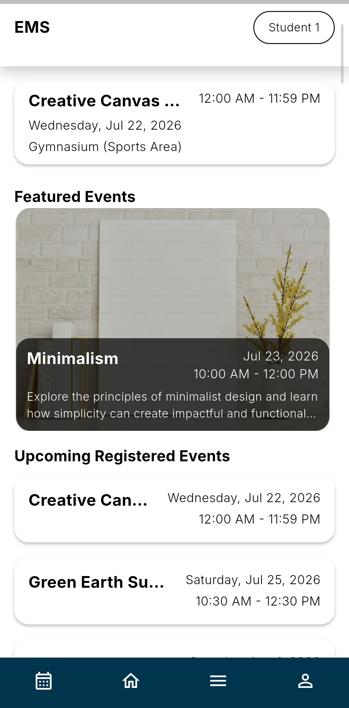
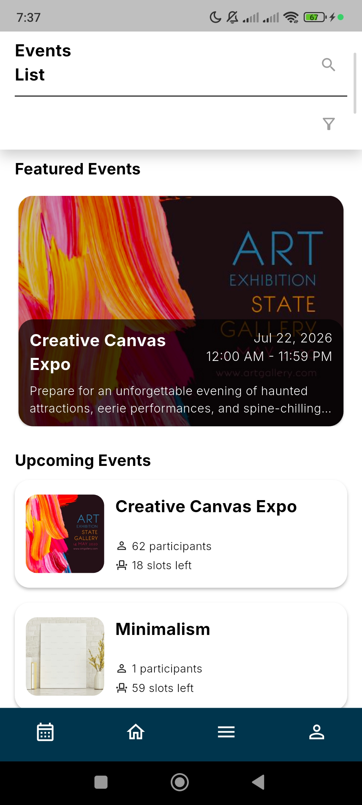
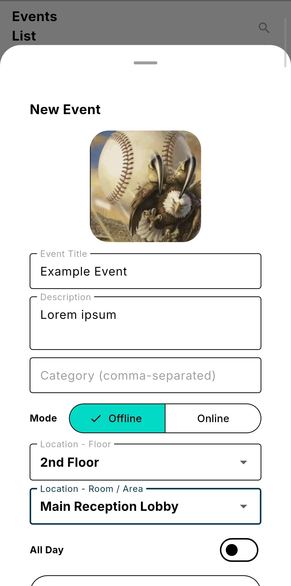
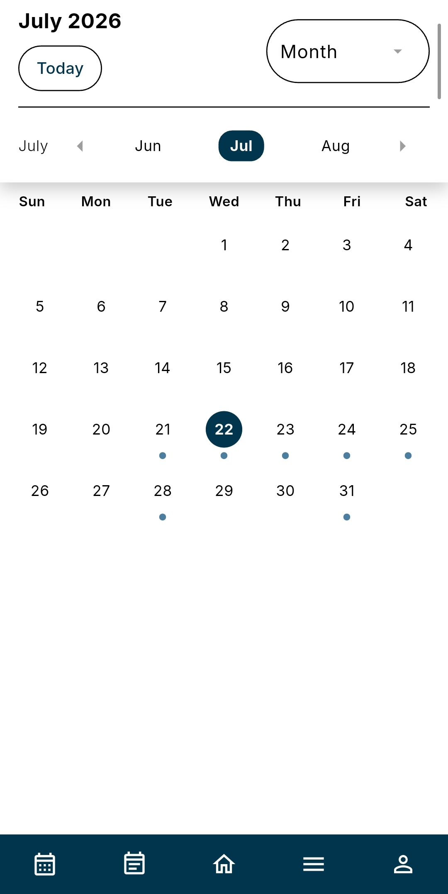
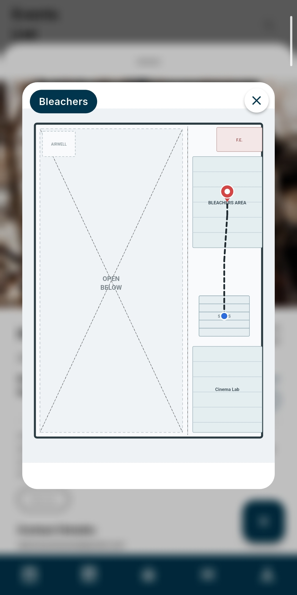
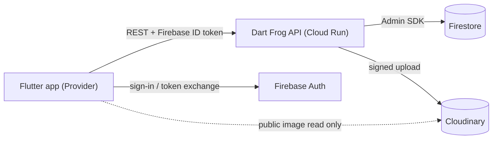

# Event Management System

> Also known as the **Campus Event App**

[](CHANGELOG.md)
[](https://flutter.dev)
[](https://dart-frog.dev)
[](https://firebase.google.com)
[](#license)

A mobile event-management platform for a school community of roughly **500 users**, built to replace ad-hoc Gmail event announcements with a proper browse / create / approve / register workflow. A **Flutter** app talks exclusively to a **Dart Frog** REST backend, which owns all data access to **Firestore** (via the Firebase Admin SDK) and **Cloudinary** (image storage). This is a student capstone project with a defined end-of-life after finals.

---

## Table of Contents

- [Screenshots](#screenshots)
- [Features](#features)
- [Tech Stack](#tech-stack)
- [Architecture](#architecture)
- [Repository Structure](#repository-structure)
- [Getting Started](#getting-started)
- [Roles & Permissions](#roles--permissions)
- [Error Codes](#error-codes)
- [Deployment](#deployment)
- [Testing](#testing)
- [Team](#team)
- [Versioning & Releases](#versioning--releases)
- [License](#license)

---

## Screenshots

| Dashboard | Events / Browse | Event Detail |
|---|---|---|
|  |  |  |

| Create Event | Calendar | Indoor Map |
|---|---|---|
|  |  |  |

---

## Features

- **Authentication & roles** — Firebase email/password sign-in (custom-token exchange); role auto-detected from the email domain (`@ciit.edu.ph` → student, otherwise guest).
- **Browse, filter & search events** — paginated feed with tag filters and title search; "featured" (soonest upcoming) and an upcoming-only view.
- **Event detail modal** — full event view with per-caller registration state.
- **Create & edit events** — full form with a Cloudinary cover-image upload; floor→room location picker wired to the wayfinding map.
- **Approval workflow** — organizer-created events start `pending`; faculty / super_admin created events auto-approve. Review queue with approve / reject (optional reason) / reopen.
- **Registration** — register and cancel for an event with slot tracking; guest-registration rules enforced.
- **Dashboard** — "next registered" banner + registered-events list, with ended events filtered out.
- **Calendar** — Day / Week / Month views of the event feed.
- **Indoor wayfinding maps** — static SVG floor plans with a destination pin and a lobby→room route (no GPS).
- **Admin area** — role-gated management surface: role promotion/demotion and the event review/reject/reopen queue.
- **My activity** — "Created Events" (owner management) and "Previous Registrations" history.

---

## Tech Stack

| Layer | Technology |
|---|---|
| **Frontend** | Flutter (Dart), Provider (`ChangeNotifier`); Riverpod available for newer work; `go_router` for navigation |
| **Backend** | Dart Frog (Dart) REST API — the single data-access layer |
| **Auth** | Firebase Authentication (email/password only) |
| **Database** | Cloud Firestore via Firebase Admin SDK (Security Rules are deny-all; the Admin SDK bypasses them) |
| **Image storage** | Cloudinary (server-side signed uploads) |
| **Hosting** | Google Cloud Run (Docker) |

---

## Architecture

The Flutter app **never** talks to Firestore or Cloudinary directly — every read and write goes through the Dart Frog backend. The one exception is displaying public cover images straight from the Cloudinary CDN URL (a read of a public asset, not data access).



Auth flow: the backend mints a custom token (`createCustomToken`), the app exchanges it via `signInWithCustomToken()`, then sends the resulting Firebase ID token on every authenticated request. Protected routes run a four-step middleware: token verification → Firestore user lookup → `is_deleted` check → role check.

---

## Repository Structure

This is a monorepo with two independently runnable apps. Each has its own detailed setup guide.

```
campus_event_app/
├── frontend/    # Flutter mobile client  → see frontend/README.md
├── backend/     # Dart Frog REST API      → see backend/README.md
├── CHANGELOG.md
└── README.md    # you are here
```

- **[frontend/README.md](frontend/README.md)** — Flutter setup, architecture, and conventions.
- **[backend/README.md](backend/README.md)** — Dart Frog setup, Firebase & Cloudinary config, routes, and Docker.

---

## Getting Started

### Prerequisites

- Flutter SDK (stable channel) + Android Studio / VS Code with the Flutter & Dart plugins
- Dart SDK + the Dart Frog CLI (`dart pub global activate dart_frog_cli`)
- Access to the project's Firebase and Cloudinary accounts (ask the team lead)

### Clone

```bash
git clone https://github.com/Larusu/campus_event_app.git
cd campus_event_app
```

### Run

Each side has its own instructions — follow them in order:

1. **Backend** → [backend/README.md](backend/README.md) (create `backend/.env`, then `dart_frog dev`).
2. **Frontend** → [frontend/README.md](frontend/README.md) (add `google-services.json`, point `apiBaseUrl` at the backend, then `flutter run`).

---

## Roles & Permissions

Roles are stored in Firestore only (no Firebase custom claims). Role is auto-detected at registration from the email domain.

| Role | How obtained | Key abilities |
|---|---|---|
| **guest** | Non-school email domain | Browse public events; register only where an event is open to guests |
| **student** | `@ciit.edu.ph` email | Browse + register for events |
| **organizer** | Promoted from student | Create / edit / delete own events (edits by organizers can reset approval) |
| **faculty** | Promoted from organizer | All organizer abilities + review queue (approve/reject/reopen); their edits never reset approval |
| **super_admin** | Highest role | All faculty abilities + full role management |

**Role transitions** (nobody can change their own role):

- student → organizer (by faculty / super_admin)
- organizer → faculty (super_admin only)
- organizer → student demote (by faculty / super_admin)
- guest is unpromotable; faculty & super_admin are terminal (undemotable)

---

## Error Codes

The API returns a standardized `{ success, message, ... }` envelope. Error codes are namespaced:

- **`AUTH001`–`AUTH011`** — authentication / authorization / user errors (`backend/lib/constants/error_codes.dart`).
- **`EVT001`–`EVT012`** — event feed, creation, moderation, and registration errors (`backend/lib/constants/event_error_codes.dart`).

The frontend maps these codes to user-facing messages via its own error-code constants.

---

## Deployment

The backend is containerized and deployed to Google Cloud Run.

```bash
cd backend
dart_frog build                                   # generates build/ with a Dockerfile
docker build -t campus-app-backend build/
docker run -p 8080:8080 --env-file .env campus-app-backend
```

- In production, Firebase & Cloudinary credentials are set as **Cloud Run environment variables** (not an `.env` file); Cloud Run service identity removes the need for a service-account key in prod.
- **Firestore Security Rules** (`backend/firestore.rules`, deny-all) are deployed once per project via the Firebase CLI (`firebase deploy`) — they are policy, not secrets, and belong in version control.

See [backend/README.md](backend/README.md) for the full Docker and Firebase workflow.

---

## Testing

```bash
# Backend
cd backend && dart test && dart analyze

# Frontend
cd frontend && flutter analyze && dart run custom_lint
```

> Note: "clean" analysis is measured under the project's `analysis_options.yaml`; `dart run custom_lint` surfaces a known `missing_provider_scope` false positive because the app roots on Provider rather than Riverpod.

---

## Team

Six-person project team.

| Member | Role |
|---|---|
| Sean | Backend developer, Client |
| Bjorn | Backend developer, Analyst |
| Rysa | Frontend developer, Designer |
| Jhervis | Frontend developer, Project Manager |
| Jeff | Fullstack developer, Tester |
| Lars | Fullstack developer, Dev Lead |

---

## Versioning & Releases

This project follows [Semantic Versioning](https://semver.org): `MAJOR.MINOR.PATCH`.

- **MAJOR** — incompatible changes
- **MINOR** — new backward-compatible features
- **PATCH** — backward-compatible bug fixes

Current release: **v1.1.0**. See the [CHANGELOG](CHANGELOG.md) for release notes.

---

## License

Private project —All rights reserved by Marquez Family. Do not redistribute without permission.
